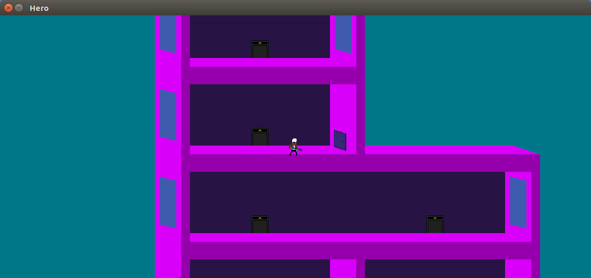
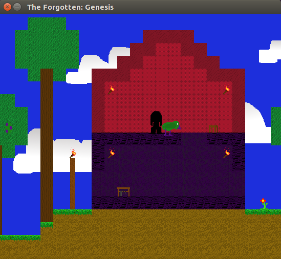
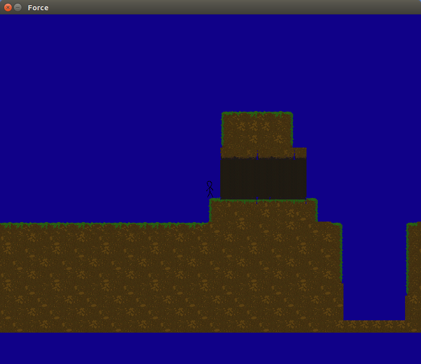

# ArchGE 0.2 - A 2D Game Engine written in C++ and using SDL2 #
Created by Archeantus Games

Linux: [](https://travis-ci.org/jarreed0/ArchGE)
Window: [](https://ci.appveyor.com/project/jarreed0/archge/branch/master) (I can't figure out how to display this...)


# Check out our NEW [PDF](http://jar.ylimaf.com/archge/docs/latex/refman.pdf) documentation for ArchGE! #
# Check out the NEW [online docs](http://jar.ylimaf.com/archge/docs/html/annotated.html) #

# Under Heavy Development #
## Next Update: (will include) ##
- [x] Object coordinate system
- [x] Object movement
- [x] Adding Objects (and there children) to a Level
- [x] Have screen follow a specific Object (the player).
- [ ] Set up Camera/Lens movement
- [ ] Fix bugs
- [x] New Input class/method - Done
- [ ] Splashscreen fix - In Progress using Gamestate class

# News #
 - - - -



## New Version of ArchGE ##
After several long hours we finally released a new version of Arch Game Engine. The new engine implements the coordinate system, map, tilesets, and levels differently. Because of this the old sample games are no longer supported with **ArchGE 0.2**.

## Update MANAGE now and never have to remember to update again! ##
The newest version of manage can check for updates! and let you know about them and update without distubring your current manage process.

Update with: `./manage -s`

## Tutorials!!! Finally! ##
Just below this news section we have some tutorials on how to set up a game using **ArchGE 0.2**

## Docs! ##
Along with the tutorials we have tons of docs generated with doxygen from the incode-comments.

Check out the [PDF](http://jar.ylimaf.com/archge/docs/latex/refman.pdf) or the [website](http://jar.ylimaf.com/archge/docs/html/annotated.html)

## Problems ##
Currently **ArchGE 0.2** has a few minor bugs.

The known bugs include the following:

- The splashscreen no longer works.
 We are currently working on this right now!
 Bypass it with the `debugMode()` feature.
- Input! Input! Input!
 The input class, sadly didn't have any sort of overhaul in the latest update.
 Because of this there is a few bugs from the previous ArchGE version.
 Update on the way!

Know of any other bugs? Let us know!



# Tutorials #
 - - - -
Check out test games for more examples.

Currently there is only two (and they don't do much) because the older games aren't supported on this engine version.
More sample games on the way!

## Setting Up The Engine ##
The Engine has a few simple steps to setting it up and creating a window.

Declaring the Engine

`Engine e;`

Setting in debug mode (required as of now because of broken splashscreen)

`e.debugMode(true);`

Currently the debug mode is only used to bypass the splashscreen, eventually is will have more tools for debuggers.

Creating the window
```
string NAME = "Window Title";
int WIDTH = 750; //Window width;
int HEIGHt = 530; //Window height;
e.init(NAME, WIDTH, HEIGHT, 0); //0 is for extra SDL_Init flags.
```
This is the simplest way to create a window. Check out ArchGE's new docs for other functions to create more advance windows.

Setting the background color

`e.setColor(0x00, 0xf8, 0x99);`

Just uses simple RGB colors.

Setting the background

`e.setBackground("background.png");`

(ArchGE 0.2 currently supports PNG and BMP images)

Automatically close on Quit and Esc

`e.exitOnEscape(true);`

Set frame rate

`e.setFrameRate(30);`

Frame rate is automatically set to 60.

## Setting Up A Game Loop ##
Here is a samle game loop:
```
void Game::loop() {
  while(running) {
    e.loopStart();
    e.update();
    input(); //user defined
    update(); //user defined
    draw(); //user defined
    e.render();
  }
}
```

## Creating A Level ##
Currently Levels stores tilesets and maps.
The will store Objects in the next update.

Declarations
```
int TILE_SIZE = 24;
int TOTAL_TILES = 60;
Level level;
Stage stage;
Map map;
Tileset tileset;
```

Loading them in
```
tileset.create("tiles", "res/tiles.bmp", e.getRenderer(), TILE_SIZE, TILE_SIZE, TOTAL_TILES/12, 12, TOTAL_TILES); //Name of tileset, file for tiles (BMP or PNG), renderer, width of a tile, height of a tile, how many rows there are, how may tiles per row, how many tiles.
map.loadMap("res/1.level");
level.setPrecise(true); //Precision makes it so that the coordinates at the end of a map file are either per pixel instead of per Tile
stage.createStage(map, tileset);
level.setStage(stage);
level.create();
level.setScale(40, 40);
level.setScreenSize(WIDTH, HEIGHT);
```
There are other ways to do this. Check out the docs for them.

Draw the Level

`e.draw(level)`

Move the Level

`level.move(mx, my)`

## Creating an Object ##

Declaration of an Object
```
Object chest;
chest.setImage("chest.png");
chest.setFrame(0, 0, 55, 35); //x, y, width, height of source to parse from image
chest.setDest(100, 200, 55, 35); //x, y, width, height of where to display the object
chest.setPos(250, 350, 55, 35); //x, y, width, height of where the object is relative to the Level
```

Declaration of an Entity
```
Entity character;
character.setImage("player.png", e.getRenderer());
character.setFrame(0, 0, 25, 45); //x, y, width, height of source to parse from image
character.setDest(100, 200, 25, 45); //x, y, width, height of where to display the object
character.setPos(250, 350, 25, 45); //x, y, width, height of where the object is relative to the Level
character.setMaxHealth(100);
character.setHealth(90);
```
You can also damage and heal the Entity
```
character.damage(10);
character.heal(15);
```

Drawing the Object
```
e.draw(character);
e.draw(chest);
```
You can also draw vectors of Objects
```
vector<Object> objects;
objects.push_back(chest);
objects.push_back(character);
e.draw(objects);
```


## Build The Game ##
`g++ *.cpp -larch -lSDL2 -lSDL2_image -std=c++11`

or (if you have the build.sh and ebuild.sh files)

`manage -g GAMEDIR/`

Makefile generation coming soon.



# Manage #
 - - - -

## Try out manage: ##

`chmod u+wx manage`

`./manage -s (or setup)`

`manage -i (or install)`

## Update now and never have to remember to update again! ##
The newest version of manage can check for updates! and let you know about them and update without distubring your current manage process.

Update with: `./manage -s`

## Build engine with manage: ##

`manage engine (or -e)`

## Build game with engine: ##

`manage game (or -g)` GAMEDIR (the game needs a ./build.sh, just copy it from the snake one and edit it a bit)

## Test engine/game with the newest version ##

`manage test GAMEDIR`

## Push back to main branch ##

`manage push (all for everything -or- specifiy file)`

## Find out more: ##

`manage -h (or help)`

And yes I know it is a little cluttered and keep in mind it has a few errors.

- - - -

Archeantus Games

[Website](http://archeantus.net/)


